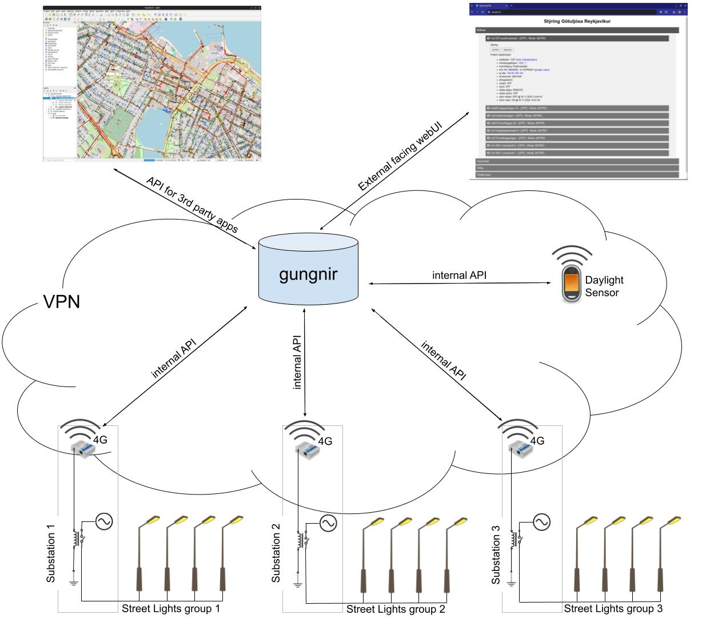

  

**Gungnir** is an open-source control system designed to manage city street lights efficiently and cost-effectively. Built with simplicity, scalability, and interoperability in mind, Gungnir aims to provide municipalities with a reliable, taxpayer-friendly solution for smart lighting control.

## Project Goals
The core philosophy behind Gungnir is to develop a straightforward yet powerful system to minimize expenditure while maximizing functionality for citywide street lighting. This is achieved by focusing on the following principles:
- **Simplicity**: A system that works seamlessly with minimal complexity.
- **Interoperability**: Enabling easy integration with other systems via APIs.
- **Cost-Efficiency**: Optimizing for low operational and maintenance costs.

---

---

## Development Phases

- [x] **Phase 1: Simplicity** *(Completed)*  
  The foundation of Gungnir focuses on delivering essential features:
  - **Automated Lighting**: Streetlights turn on/off automatically based on sunset/sunrise calculations.
  - **Real-Time State Awareness**: Gungnir tracks and records whether lights are on or off.
  - **Manual Override**: Operators can manually control the lights as needed.
  - **Load Staggering**: Prevents simultaneous activation to reduce strain on the power grid.

---

- [x] **Phase 2: Interoperability** *(Completed)*  
  To extend its functionality, Gungnir provides:
  - **API Support**: A robust API for third-party applications to interact with the system.

---

- [x] **Phase 3: Open-Source Release** *(Completed)*  
  Gungnir is publicly available under the [AGPL v3 License](./LICENSE) to foster community contributions and transparency. New features are added based on user requests.

---

- [ ] **Phase 4: Feature Expansion** *(In Progress)*  
  The current focus is on integrating requested features:
  - **Light Sensors**: Adding daylight sensors to offset on/off times based on ambient light and weather.
  - **Standalone Functionality**: Offline process to control lights on/off based on a pre-set schedule at the router level during internet outages.
  - **Coordinator Script**: Startup Management / Process Monitoring / Failure Notification

---

- [ ] **Phase 5: Impending Improvements** *(In Progress)*  
  Ongoing development is dedicated to enhancing the system’s scalability and robustness:
  - **Database and Framework Improvements**: Transitioning from SQLite/Flask to PostgreSQL/Gunicorn
  - **Redundancy**: Failover servers to ensure uptime during maintenance or outages.
  - **Containerization**: Packaging full system deployment planned in future updates.
  - **TALQ Compliance**: Aligning the system with international standards for smart city infrastructure.
  - **Enhanced Documentation**: Improving guides and references for developers and administrators.

---

## Contributing
We welcome contributions from the community to help improve Gungnir. Whether it's fixing a bug, suggesting a feature, or improving documentation, your input is valued. Please read our [contribution guidelines](CONTRIBUTING.md) for more details.

---

## License
Gungnir is licensed under the [GNU Affero General Public License (AGPL) v3](./LICENSE), ensuring that any modifications or enhancements made to the software benefit the open-source community.

---

## Contact
For questions, feature requests, or support, feel free to contact [David Berman](mailto:david@berman.is).

---

## Acknowledgments
Gungnir was developed with the goal of providing a modern, efficient solution for streetlight management. Thank you to the open-source community for inspiration and support
